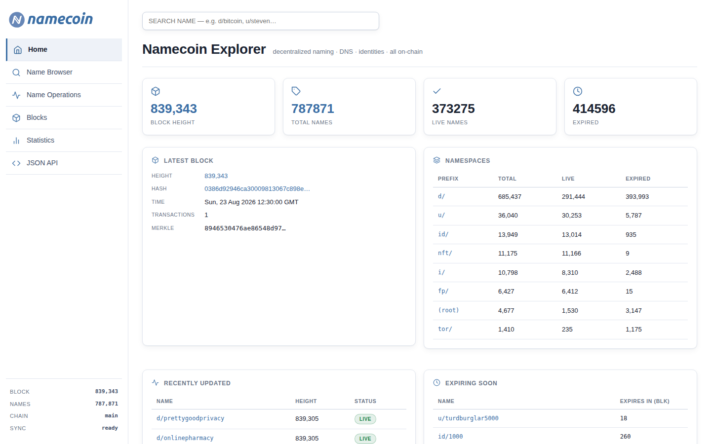
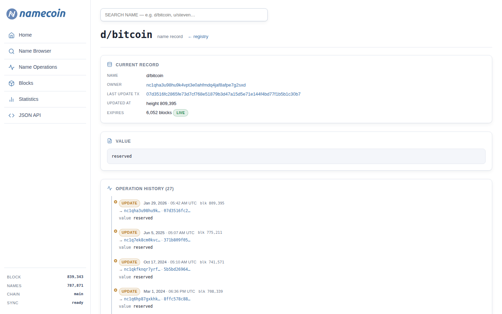
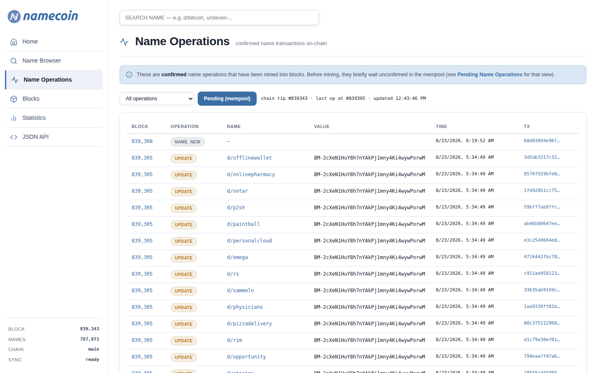

<div align="center">

  # Namecoin Explorer

  [](LICENSE)
  [](https://nodejs.org)
  [](#)
  [](#)

  ### Industrial-grade, Namecoin-native block explorer & name browser

  A complete **name browser** and **blockchain operations explorer** for
  [Namecoin](https://namecoin.org) — the world's first fork of Bitcoin, born with a
  mission to give humans a **censorship-resistant namespace for names, DNS, and
  identities** on-chain.

  Browse the full ~780,000-name registry, trace the complete append-only provenance
  of any name back to its genesis registration, follow live name operations, and
  query everything over a clean REST + JSON API — all backed by your own full node.

</div>

---

## Table of Contents

- [Features](#features)
- [Screenshots](#screenshots)
- [Quick Start](#quick-start)
- [Configuration](#configuration)
- [JSON API](#json-api)
- [Architecture](#architecture)
- [Deployment](#deployment)
- [Roadmap](#roadmap)
- [Contributing](#contributing)
- [Security](#security)
- [License](#license)

---

## Screenshots

<table>
<tr>
  <td width="50%"></td>
  <td width="50%"></td>
</tr>
<tr>
  <td colspan="2" align="center"></td>
</tr>
</table>

---

## Features

### 🔎 Name browser (registry)
- Browse the **full on-chain registry** (~780,000 names) with cursor pagination
- Filter by **namespace** (`d/`, `u/`, `id/`, …) and by **status** (live / expiring / expired)
- Instant **search & autocomplete** against an indexed local cache
- Rich **name detail** pages: current record, decoded value, expiry, owner

### 🧬 Full provenance timeline
- Every name page shows its **complete append-only operation history** — from the
  genesis registration (e.g. `d/bitcoin` at **block 142, 21 April 2011**) to the
  present, **including expired names** (the chain never forgets)
- Each operation is **type-labelled** (`REGISTER`, `UPDATE`, `RENEW`, `NEW`,
  `TRANSFER`) with **real block dates**, block heights, transaction links, and the
  full value — because `name_history` alone doesn't expose op types or dates, this
  is resolved by decoding each transaction on demand

### ⚡ Name operations explorer
- Live **operations feed** of mined `OP_NAME_*` transactions from recent blocks
- **Pending (mempool)** view of unconfirmed name operations
- Block & transaction pages annotated with which txs carry name ops and what they did

### 🎨 Design system
- Clean, modern light/dark **theme** matching Namecoin's identity
- Mobile-responsive: partial-width drawer, app-bar header, wrapped values
- Namecoin-blue palette, readable tables, operation color-coding
- No forced framework gymnastics — Bulma reset layered with a hand-tuned design system

### 🌍 JSON API
`/api/stats`, `/api/search`, `/api/names`, `/api/name/*`, `/api/health` — machine
readable access to everything the UI shows.

---

## Quick Start

### Prerequisites

You need a **synchronised Namecoin Core full node** with the name index enabled,
and **Node.js ≥ 20**.

```bash
# 1. Install & run namecoind (RPC on 127.0.0.1:8336, txindex=1, namehistory=1)
#    see: https://www.namecoin.org/get-started/
```

### Run the explorer

```bash
git clone https://github.com/historicsxyz/namecoin-explorer.git
cd namecoin-explorer
npm install

# Configure the RPC connection (see Configuration)
cp .env.example .env

# Point the app at your namecoind RPC either via .env or the node's cookie file
npm start
```

Then open <http://127.0.0.1:3100>.

By default the app authenticates to namecoind using the RPC **cookie file**
(`/var/lib/namecoin/.cookie`). If you prefer explicit credentials, set
`NMC_RPC_USER` / `NMC_RPC_PASS`.

> **Note:** The first time the explorer starts it snapshots the registry into a
> local SQLite cache (`data/cache.db`) in the background. Browsing a huge registry
> (780k+ names) is fast because list/search queries hit the cache, not the node.

---

## Configuration

Configuration is via environment variables (see [`.env.example`](.env.example)):

| Variable | Default | Description |
|----------|---------|-------------|
| `NMC_EXPLORER_PORT` | `3100` | HTTP port the UI/API listens on |
| `NMC_RPC_HOST` | `127.0.0.1` | namecoind JSON-RPC host |
| `NMC_RPC_PORT` | `8336` | namecoind JSON-RPC port |
| `NMC_RPC_USER` | `hermes` | RPC auth username (used only if no cookie file) |
| `NMC_RPC_PASS` | *(cookie)* | RPC auth password (leave empty to use the cookie file) |
| `NMC_COOKIE_PATH` | `/var/lib/namecoin/.cookie` | Path to namecoind's RPC cookie |
| `NMC_CACHE_DB` | `./data/cache.db` | SQLite registry cache location |
| `NMC_REFRESH_MS` | `21600000` | Registry cache refresh interval (6 h) |

---

## JSON API

> Names contain a `/` (e.g. `d/bitcoin`), so URL-encode them: `d%2Fbitcoin`.

| Endpoint | Description |
|----------|-------------|
| `GET /api/stats` | Global stats: total/live/expired names, namespace breakdown, chain state |
| `GET /api/search?q=…` | Name autocomplete (max 30) |
| `GET /api/names?limit=…&start=…&ns=…` | Paginated registry page |
| `GET /api/name/:name` | Current record for a single name |
| `GET /api/health` | Liveness + sync status |

```bash
curl https://your-host/api/name/d%2Fbitcoin
```

---

## Architecture

```
Browser
   │  HTTP / HTTPS
   ▼
Namecoin Explorer (Node/Express, port 3100)
   ├─ lib/rpc.js      hardened JSON-RPC client for namecoind (cookie or user/pass,
   │                  explicit hex<->name encoding, sequential queue, fail-loud)
   ├─ lib/names.js    value classification + decoding + operation timeline builder
   ├─ lib/txops.js    extracts OP_NAME_* ops from transactions
   ├─ lib/cache.js    SQLite (better-sqlite3) registry cache — list/search/aggregate
   ├─ lib/registry.js background registry sync (paged name_scan) + periodic refresh
   └─ lib/routes.js   operations feed, namespace, blocks, txs, stats + JSON API
   │
   ▼
Namecoin Core (namecoind, RPC on 127.0.0.1:8336)
   │  name_scan / name_show / name_history / name_pending / getblock*
   ▼
Full blockchain (txindex=1, namehistory=1)  ▸  SQLite cache (data/cache.db)
```

**Design choices**

- **Fail loud, never guess.** The RPC client raises on node errors instead of
  silently returning an "available / not found" — a hard-won lesson from Namecoin's
  quirks where non-ASCII names and stderr handling can produce false results.
- **Cache for scale.** A 780k-name registry can't be paged over RPC efficiently;
  SQLite mirrors it for fast browsing while the node stays authoritative.
- **Provenance by re-execution.** Namecoin's `name_history` doesn't return op types
  or dates, so the explorer decodes each historical transaction and its block header
  to reconstruct a fully-labelled, dated timeline — the true append-only record.
- **Namecoin-native, not Bitcoin-native.** The app is registry-first (names are the
  point of Namecoin), with neutral block/tx views underneath.

See [ARCHITECTURE.md](ARCHITECTURE.md) for the deep dive.

---

## Deployment

The included setup assumes running behind [Caddy](https://caddyserver.com) for
automatic HTTPS, with `namecoind`, the explorer, and Caddy managed by systemd. A
production guide lives in [docs/DEPLOYMENT.md](docs/DEPLOYMENT.md).

Bind the app to `127.0.0.1` and reverse-proxy it — never expose the RPC port.

---

## Roadmap

- [x] Full registry browser + namespace/status filters
- [x] Name detail with complete, typed, dated operation provenance
- [x] Operations feed + pending (mempool) name operations
- [x] JSON API
- [ ] Op-type filter on the operations feed
- [ ] `NAME_NEW` commitment-visibility toggle
- [ ] Multi-node / read-replica support
- [ ] i18n (the Namecoin community is global)

---

## Contributing

Contributions are welcome and encouraged! Please read
[CONTRIBUTING.md](CONTRIBUTING.md) for guidelines, and note this project adheres to
a [Code of Conduct](CODE_OF_CONDUCT.md).

Key areas that always need love: new tests, performance, accessibility, and
translations.

---

## Security

Found a vulnerability? See [SECURITY.md](SECURITY.md) for our disclosure policy.
Do **not** open a public issue for security bugs.

---

## License

[MIT](LICENSE) © 2026 [historicsxyz](https://github.com/historicsxyz)

---

<div align="center">
  Built for the Namecoin community · <em>freedom of information, on-chain.</em>
</div>